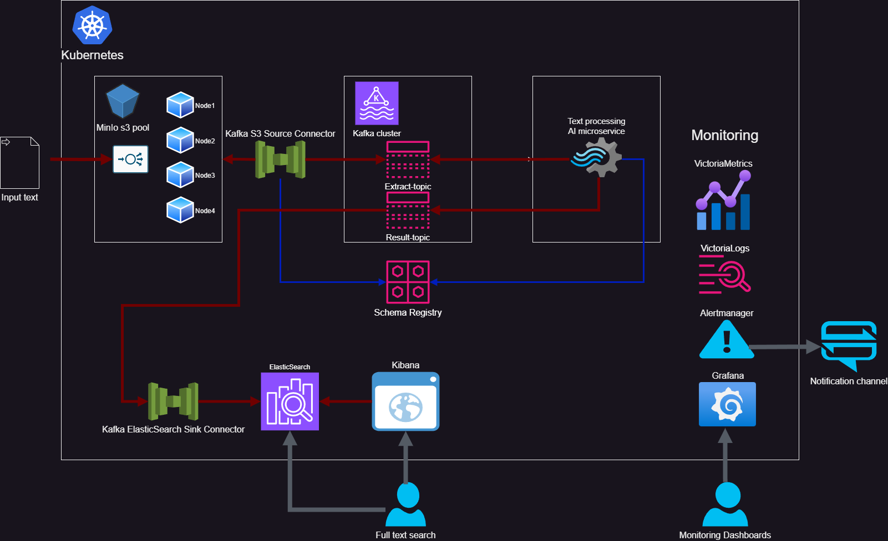
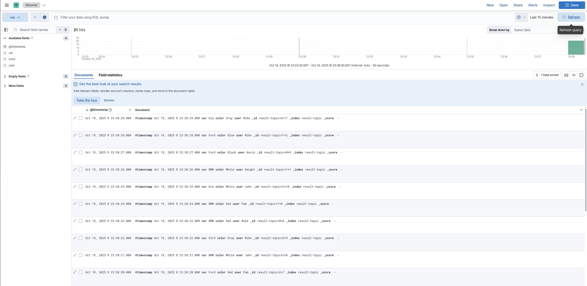

# Kubernetes Data Pipeline Setup Guide

This guide helps you set up a complete data pipeline using Kubernetes with various monitoring, logging, and data processing components.

## Architecture Overview

* **Data Ingestion**
  * **Source:** Raw text files are stored in an **MinIO** (S3-compatible) bucket.
  * **Ingestion Tool:** The **Lenses S3 Source Connector** for Kafka Connect reads the files and streams them into a Kafka topic.

* **Stream Processing**
  * **Tool:** A custom application or consumer.
  * **Function:** Consumes the raw text data, simulates text processing (e.g., NLP, sentiment analysis, data enrichment), and produces the refined results to a new Kafka topic.

* **Data Sinking & Indexing**
  * **Destination:** Processed data is persisted in **Elasticsearch** for powerful search and analytics.
  * **Ingestion Tool:** The **Confluent Elasticsearch Sink Connector** for Kafka Connect streams the data from Kafka into Elasticsearch indices.

* **Observability & Monitoring**
  * **Metrics:** System, JVM, and custom application metrics are collected and visualized using **VictoriaMetrics**.
  * **Logging:** All application and infrastructure logs are centralized, stored, and analyzed using **VictoriaLogs**.

MinIO S3 → Kafka Connect S3 Source → Kafka → Microservice → Kafka Connect ElasticSearch Sink → ElasticSearch/Kibana
│
└── VictoriaMetrics (Monitoring) + VictoriaLogs (Logging) + Grafana (Visualization)



## Requirements

* docker
* kubectl
* kind cli
* helm

## Setup real-time pipeline

### 1. Kubernetes Cluster Setup

Run the following command to create a Kubernetes cluster with 1 control-plane node and 3 worker nodes:

```bash
./cluster-setup.sh
```

Components deployed:

* Ingress-nginx

* MetalLB

* 4 proxy image repositories in Docker containers

### 2. Deploy VictoriaMetrics kubernetes stack with Grafana and VictoriaLogs Datasource

Run `./setup-vm.sh`

Grafana Access:

* Login: admin

* Get Password: `kubectl get secret --namespace victoria-metrics vm-grafana -o jsonpath="{.data.admin-password}" | base64 --decode ; echo`

### 3. Ingress Nginx Setup

Run `setup-nginx.sh`

Recommended Dashboard:

* [Kubernetes Nginx Ingress Controller Dashboard (ID: 14314)](https://grafana.com/grafana/dashboards/14314-kubernetes-nginx-ingress-controller-nextgen-devops-nirvana/)

### 4. VictoriaLogs with Vector

Run `./setup-vl.sh`

### 5. MinIO Storage Setup

Run `./setup-minio.sh`

MinIO Console Access:

* URL: <http://minio-console.kind.cluster>

* Login: minio

* Password: minio123

Recommended Dashboards:

* [MinIO Bucket Dashboard (ID: 19237)](https://grafana.com/grafana/dashboards/19237-minio-bucket-dashboard/)

* [MinIO Cluster Dashboard (ID: 13502)](https://grafana.com/grafana/dashboards/13502-minio-dashboard/)

### 6. ElasticSearch and Kibana

Run `./setup-elastic.sh`

Kibana Access:

* URL: <http://kibana.kind.cluster>

* Login: elastic

* Get Password: `kubectl get secret elasticsearch-es-elastic-user -n elastic -o go-template='{{.data.elastic | base64decode }}'`

Recommended Dashboards:

* [ElasticSearch Overview (ID: 14191)](https://grafana.com/grafana/dashboards/14191-elasticsearch-overview/)

* [Kibana Monitoring (ID: 21420)](https://grafana.com/grafana/dashboards/21420-kibana-monitoring/)

## Kafka Ecosystem Setup

### 7. Kafka Cluster and Schema Registry

Deploy 3 Kafka brokers, 3 Kafka KRaft control nodes, and Schema Registry:

Run `./kafka-cluster.sh`

Components Deployed:

* Kafka Cluster in `kafka` namespace

* Schema Registry (accessible at `https://schema.kind.cluster`)

* KafkaUser: `confluent-schema-registry`

* KafkaTopic: `registry-schemas`

* **Warning** Schema Registry uses HTTP/2

### 8. Kafka Connectors

#### S3 Source Connector

##### Build S3 Connector Image

* Build Docker image: `docker build -t <your-repo>/<your-image-name>:<your-tag> -f kafka-s3-source-connector/Dockerfile .`

For example: `docker build -t ttl.sh/randsw-strimzi-connect-s3-4.1.0:24h -f kafka-s3-source-connector/Dockerfile .`

* Push to your docker registry

##### Configure S3 Connector

1. Edit `setup-kafka-connect-s3.sh` with MinIO credentials:

```yaml
connect.s3.aws.access.key: minio
connect.s3.aws.secret.key: minio123
```

2. Get Schema Registry truststore password:

```bash
kubectl get secret confluent-schema-registry-jks -n kafka -o go-template='{{.data.truststore_password | base64decode }}'
```

3. Update connector configuration with the password

4. Set your connector image in KafkaConnect spec

##### Deploy S3 Connector

```bash
./setup-kafka-connect-s3.sh
```

#### ElasticSearch Sink Connector

##### Build ElasticSearch Connector Image

* Build Docker image: `docker build -t <your-repo>/<your-image-name>:<your-tag> -f kafka-elasticsearch-sink-connector/Dockerfile .`

For example: `docker build -t ttl.sh/randsw-strimzi-connect-elastic-4.1.0:24h -f kafka-elasticsearch-sink-connectorDockerfile .`

* Push to your docker registry

##### Configure ElasticSearch Connector

1. Edit `setup-kafka-connect-elastic.sh` with MinIO credentials:

```yaml
connection.username: "elastic"
connection.password: "<your-kibana-password>"
```

2. Set Schema Registry truststore password (same as above)

Deploy ElasticSearch Connector:

```bash
./setup-kafka-connect-s3.sh
```

3. Update connector configuration with the password

4. Set your connector image in KafkaConnect spec

##### Deploy Elasticsearch Connector

```bash
./setup-kafka-connect-s3.sh
```

#### 9. Example Microservice

Deploy a real-time data processing microservice that:

* Consumes raw data from Kafka topics

* Validates, enriches, filters, and transforms data

* Produces processed data to downstream topics

```bash
# Create Kafka user for microservice
kubectl apply -f consumer-producer/manifests/kafka-user.yaml

# Deploy microservice
kubectl apply -f consumer-producer/manifests/deployment.yaml
```

## Pipeline Testing

Generate test data to validate the entire pipeline:

```bash
cd minio-json-generator && go run main.go
```

Verify data appears in ElasticSearch indices.


| Component | Purpose | Access URL |
|-----------|---------|------------|
| Grafana | Monitoring & Visualization | <http://grafana.kind.cluster> |
| Kibana | ElasticSearch UI & Analytics | <http://kibana.kind.cluster> |
| MinIO Console | S3 Storage Management | <http://minio-console.kind.cluster> |
| Schema Registry | Kafka Schema Management | <http://schema.kind.cluster> |

## Security Notes

* All passwords are retrieved from Kubernetes secrets

* Schema Registry uses SSL/TLS with truststore authentication

* Kafka users are managed via Strimzi KafkaUser CRD

* Ingress controllers provide external access with proper routing

## Troubleshooting

* Verify all pods are running: kubectl get pods -A

* Check ingress routes: kubectl get ingress -A

* View logs for specific components using kubectl logs

* Validate Kafka connectivity and topic creation

* Confirm MinIO bucket creation and file uploads

This setup creates a scalable and resilient data processing system with comprehensive monitoring and logging capabilities.
